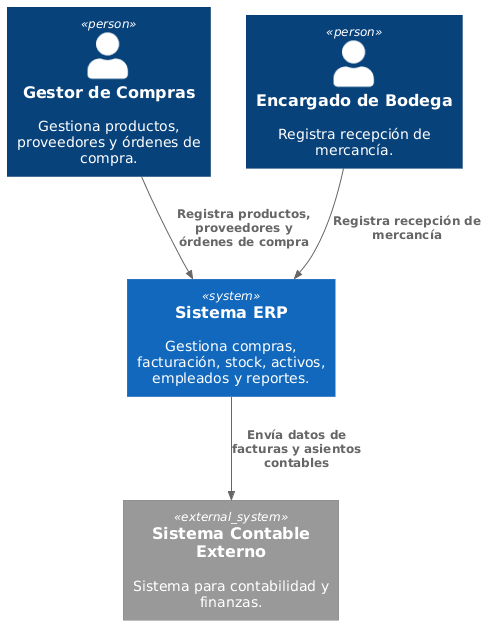

# 3. Alcance y Contexto del Sistema

El Sistema ERP interactúa con dos tipos de usuarios (Gestor de Compras y Encargado de Bodega) y con un sistema contable externo al cual envía información de facturas y asientos contables.

