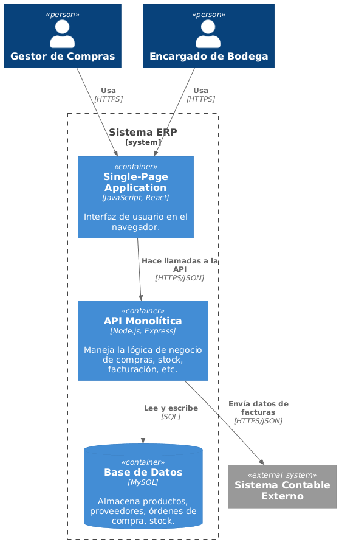
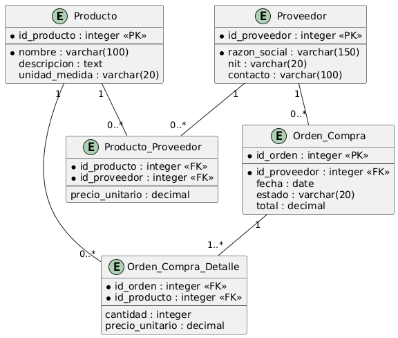

# 5. Vista de Bloques de Construcción

El sistema está compuesto por tres contenedores principales:

- **SPA (Single-Page Application):** interfaz de usuario que consumen el Gestor de Compras y el Encargado de Bodega.
- **API Monolítica (Node.js/Express):** contiene toda la lógica de negocio de compras, stock y facturación.
- **Base de Datos (MySQL):** almacena productos, proveedores, órdenes de compra y stock.

## Modelo de Datos (MER)

