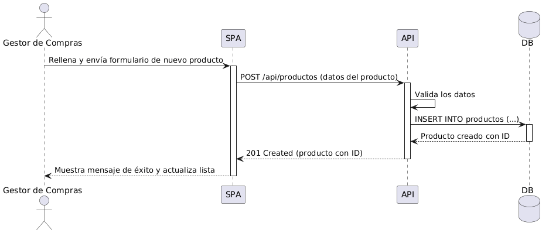

# 6. Vista de Ejecución (Runtime)

## Escenario: Registrar un Producto

1. El Gestor de Compras completa el formulario de nuevo producto en la SPA.
2. La SPA envía una petición `POST /api/productos` a la API.
3. La API valida los datos recibidos.
4. La API inserta el nuevo producto en la base de datos.
5. La base de datos retorna el producto creado con su ID.
6. La API responde con estado `201 Created`.
7. La SPA muestra un mensaje de éxito y actualiza la lista de productos.

